# 🏦 Bank of Baku RAG Assistant

<div align="center">

### Intelligent Banking Assistant with Advanced RAG Technology

[](https://www.python.org/downloads/)
[](https://flask.palletsprojects.com/)
[](https://www.docker.com/)
[](LICENSE)
[]()

*Answering questions about Bank of Baku cards with AI-powered precision*

[Features](#-features) • [Quick Start](#-quick-start) • [Architecture](#-architecture) • [Deployment](#-deployment) • [Demo](#-demo)

</div>

---

## 📋 Table of Contents

- [Overview](#-overview)
- [Key Features](#-key-features)
- [System Architecture](#-system-architecture)
- [Quick Start](#-quick-start)
- [How It Works](#-how-it-works)
- [Project Structure](#-project-structure)
- [Deployment](#-deployment)
- [Usage Examples](#-usage-examples)
- [API Reference](#-api-reference)
- [Configuration](#-configuration)
- [Contributing](#-contributing)

---

## 🎯 Overview

**Bank of Baku RAG Assistant** is a production-ready AI chatbot that provides accurate, real-time information about Bank of Baku's credit and debit card products using Retrieval-Augmented Generation (RAG) technology.

### 🌟 What Makes It Special?

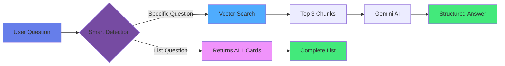

### 📊 At a Glance

| Component | Technology | Purpose |
|-----------|-----------|---------|
| **Frontend** | Flask + HTML/CSS/JS | Beautiful chat interface |
| **Backend** | Python 3.11 | RAG system logic |
| **Vector DB** | ChromaDB | Semantic search |
| **Embeddings** | Local (ChromaDB) | Zero API costs |
| **LLM** | Gemini 2.5 Flash | Answer generation |
| **Deployment** | Docker | One-click deploy |

---

## ✨ Key Features

### 🎨 Modern Web Interface

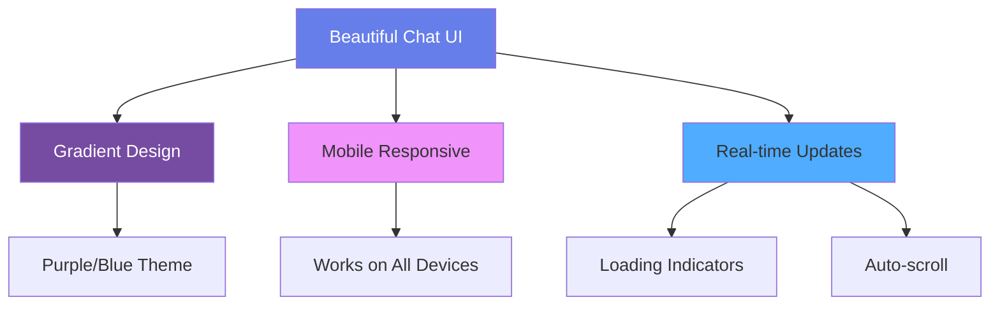

- 💬 **Chat Interface** - Intuitive conversation flow
- 🎨 **Gradient Design** - Modern purple/blue aesthetic
- 📱 **Mobile-First** - Responsive on all devices
- ⚡ **Real-time** - Instant responses with loading states
- 🔗 **Clickable Sources** - Direct links to Bank of Baku pages

### 🧠 Intelligent Question Handling

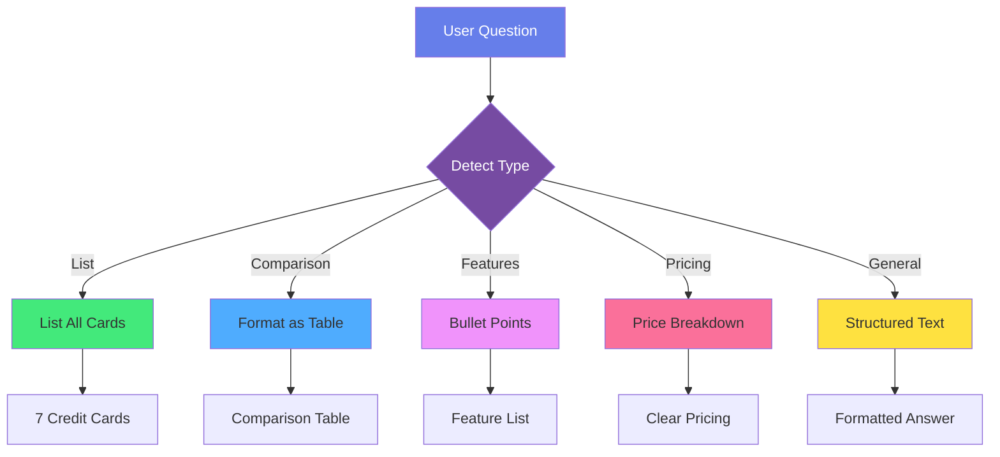

#### Question Types:

1. **📋 List Questions** → Returns ALL available cards
   - *"Hansı kredit kartları var?"*
   - Returns: All 7 credit cards

2. **⚖️ Comparison Questions** → Formatted tables
   - *"Bolkart debet və Platinum fərqi nədir?"*
   - Returns: Comparison table

3. **⭐ Best/Superlative** → Structured recommendations
   - *"Ən yaxşı debet kartı hansıdır?"*
   - Returns: Reasoned answer with bullets

4. **💰 Pricing Questions** → Clear breakdowns
   - *"Kartların qiymətləri nə qədərdir?"*
   - Returns: Organized pricing info

5. **ℹ️ General Questions** → Well-formatted responses
   - *"Maaş kartı haqqında məlumat"*
   - Returns: Detailed information

### 🔍 Advanced RAG Capabilities

- **Smart Retrieval** - Semantic search with ChromaDB
- **Local Embeddings** - No API quota limits
- **Context-Aware** - Uses relevant information only
- **Source Attribution** - Shows data sources
- **Azerbaijani Support** - Full language support

---

## 🏗️ System Architecture

### High-Level Architecture

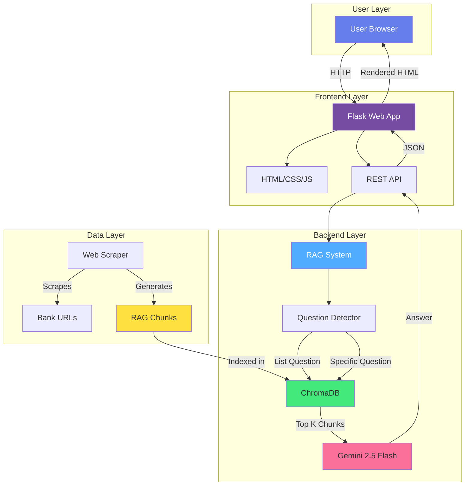

### RAG Processing Flow

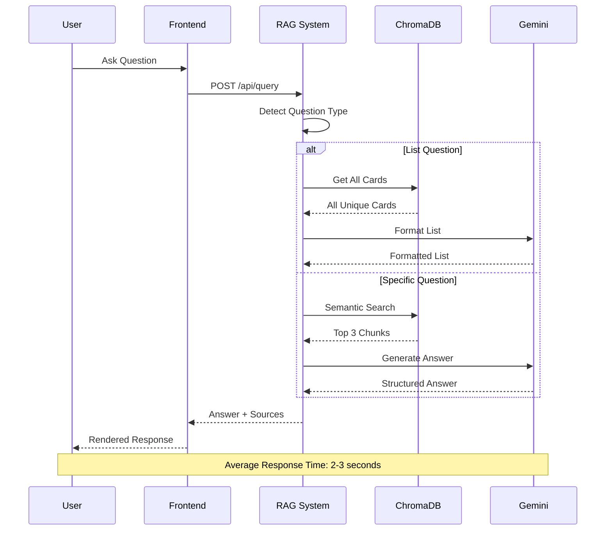

### Data Flow

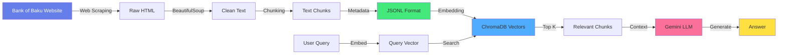

---

## 🚀 Quick Start

### Prerequisites

- **Python 3.11+** or **Docker**
- **Gemini API Key** ([Get one here](https://makersuite.google.com/app/apikey))

### Option 1: Automated Deployment (Recommended)

```bash
# Clone repository
git clone https://github.com/your-repo/banking_assistant.git
cd banking_assistant

# Run deployment script
./deploy.sh

# Opens on http://localhost:5001
```

### Option 2: Manual Docker Deployment

```bash
# Ensure .env file exists
echo "LLM_API_KEY=your_gemini_api_key" > .env

# Build and run
docker-compose up -d

# Check health
curl http://localhost:5001/api/health
```

### Option 3: Local Development

```bash
# Install dependencies
pip install -r requirements.txt

# Run application
python run.py

# Opens on http://localhost:5001
```

### Deployment Timeline

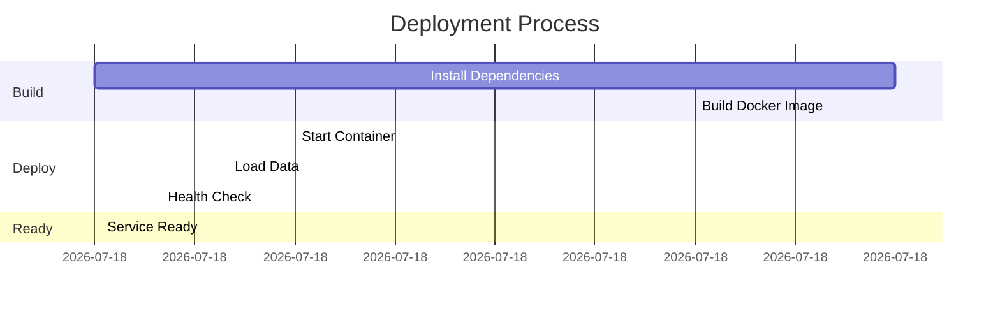

**Total Time: ~4-5 minutes** ⚡

---

## 🔧 How It Works

### 1. Data Collection

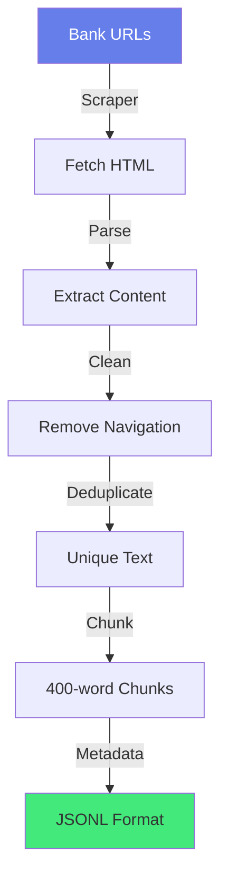

**13 Cards Scraped**:
- 7 Credit Cards
- 6 Debit Cards
- 2,607 clean words
- 100% success rate

### 2. Embedding & Indexing


**Embedding Model**: ChromaDB Default (all-MiniLM-L6-v2)
- ✅ Free & Local
- ✅ No API quota
- ✅ Fast retrieval

### 3. Query Processing

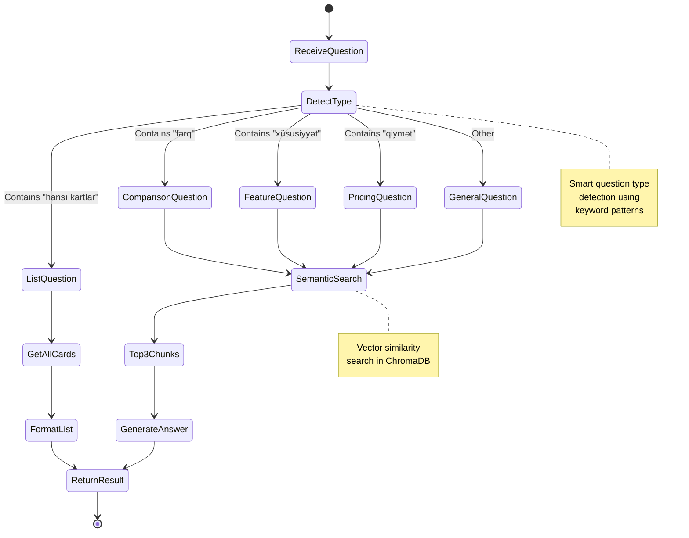

### 4. Answer Generation

**Prompt Engineering**:

```
System: You are Bank of Baku card information assistant

Context: [Retrieved chunks with card details]

Formatting Rules:
- Comparison → Use Markdown tables
- Features → Use bullet points
- Pricing → Show clear numbers
- Bold important info

User Question: [User's question in Azerbaijani]

Generate: Structured answer in Azerbaijani
```

---

## 📁 Project Structure

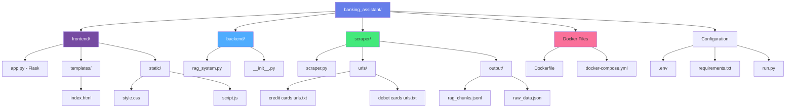

### Directory Breakdown

| Directory | Purpose | Key Files |
|-----------|---------|-----------|
| **frontend/** | Web UI | `app.py`, `templates/`, `static/` |
| **backend/** | RAG Logic | `rag_system.py` |
| **scraper/** | Data Collection | `scraper.py`, `urls/`, `output/` |
| **Root** | Config & Deploy | `Dockerfile`, `run.py`, `.env` |

---

## 🌐 Deployment

### Deployment Options Matrix

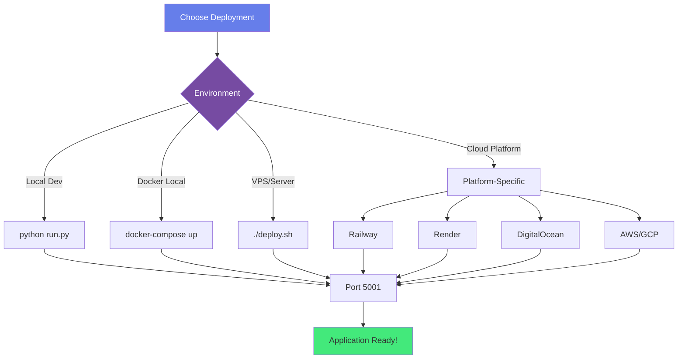

### Quick Deploy Commands

```bash
# 1. Automated (Easiest)
./deploy.sh

# 2. Docker (Production)
docker-compose up -d

# 3. Local (Development)
python run.py
```

### Environment Variables

| Variable | Required | Description | Example |
|----------|----------|-------------|---------|
| `LLM_API_KEY` | ✅ Yes | Gemini API Key | `AIza...` |
| `FLASK_ENV` | ❌ No | Environment | `production` |
| `PORT` | ❌ No | Server Port | `5001` |

### Health Monitoring

```bash
# Check application health
curl http://localhost:5001/api/health

# Expected response
{
  "status": "healthy",
  "indexed_chunks": 13
}
```

---

## 💡 Usage Examples

### Example 1: List All Cards

**Question**: *"Hansı kredit kartları var?"*

**Response**:
```
Bank of Baku-da mövcud olan kredit kartları:

1. Bolkart kredit
2. Bolkart Gold kredit
3. Bolkart Diamond kredit
4. Qızıl kredit kartı
5. Dostlar klubu Gümüş
6. Dostlar klubu Qızıl
7. Dostlar klubu Brilliant

📎 Mənbələr: [Clickable links to each card]
```

### Example 2: Comparison Table

**Question**: *"Bolkart debet və Platinum fərqi nədir?"*

**Response**:

| Xüsusiyyət | Bolkart Debet | Bolkart Platinum |
|------------|---------------|------------------|
| **Qiymət** | Pulsuz | 50-70 AZN |
| **Tip** | Visa/MC | Visa Platinum |
| **Min. Balans** | 300 AZN | 3,000 AZN |
| **Faiz** | 7% | 7% |
| **Keşbek** | ✓ | ✓ |

### Example 3: Feature List

**Question**: *"Keşbek xüsusiyyəti olan kartlar hansılardır?"*

**Response**:
```
Keşbek xüsusiyyətli kartlar:

• Bolkart kredit - Müxtəlif sahələr üzrə keşbek
• Bolkart Gold kredit - Artırılmış keşbek limitləri
• Maaş kartı - 3 kateqoriya seçmək imkanı
• Bolkart debet - Standart keşbek şərtləri
```

---

## 📡 API Reference

### POST `/api/query`

Query the RAG system with a question.

**Request:**
```json
{
  "question": "Hansı kredit kartları var?"
}
```

**Response:**
```json
{
  "answer": "<html formatted answer>",
  "sources": [
    {
      "card_name": "Bolkart kredit",
      "card_type": "credit",
      "url": "https://www.bankofbaku.com/..."
    }
  ],
  "card_count": 7
}
```

### GET `/api/cards`

Get all available cards.

**Parameters:**
- `type` (optional): `"credit"` or `"debet"`

**Response:**
```json
{
  "cards": [...],
  "count": 13
}
```

### GET `/api/health`

Health check endpoint.

**Response:**
```json
{
  "status": "healthy",
  "indexed_chunks": 13
}
```

---

## ⚙️ Configuration

### Docker Configuration

**Resource Limits** (docker-compose.yml):
```yaml
deploy:
  resources:
    limits:
      cpus: '1.0'
      memory: 1G
    reservations:
      cpus: '0.5'
      memory: 512M
```

**Logging**:
```yaml
logging:
  driver: "json-file"
  options:
    max-size: "10m"
    max-file: "3"
```

### Application Settings

Edit `run.py` for custom port:
```python
app.run(host='0.0.0.0', port=5001, debug=False)
```

---

## 📊 Technical Specifications

### Performance Metrics

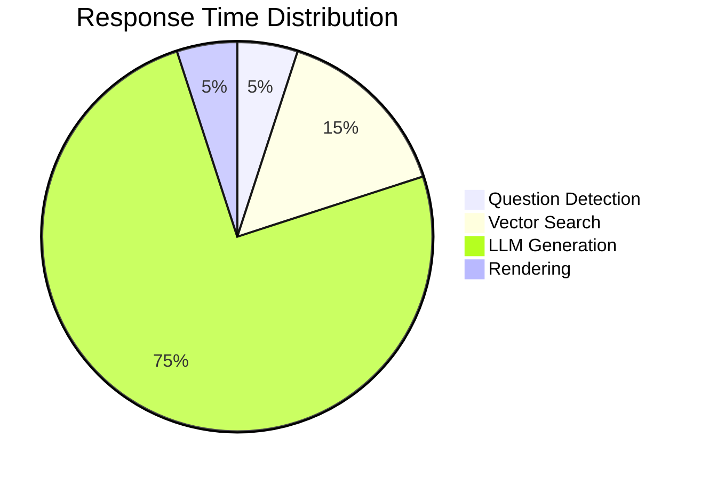

| Metric | Value |
|--------|-------|
| **Avg Response Time** | 2-3 seconds |
| **Indexed Chunks** | 13 |
| **Cards Covered** | 13 (7 credit + 6 debit) |
| **Embedding Model** | all-MiniLM-L6-v2 |
| **LLM Model** | Gemini 2.5 Flash |
| **Languages** | Azerbaijani |

### Technology Stack

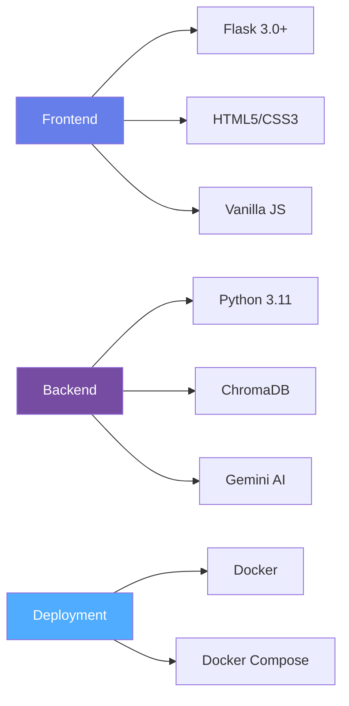

---

## 🎨 Screenshots

### Chat Interface
```
┌─────────────────────────────────────────────────┐
│  🏦 Bank of Baku - Kart Məlumat Köməkçisi      │
│                                         [Ready] │
├─────────────────────────────────────────────────┤
│                                                 │
│  🤖 Salam! Mən Bank of Baku-nun kart          │
│     məhsulları haqqında kömək edə bilərəm.    │
│                                                 │
│  👤 Hansı kredit kartları var?                │
│                                                 │
│  🤖 Bank of Baku-da mövcud olan kredit        │
│     kartları:                                  │
│     1. Bolkart kredit                         │
│     2. Bolkart Gold kredit                    │
│     ...                                        │
│                                                 │
│     📎 Mənbələr: [Links]                      │
│                                                 │
├─────────────────────────────────────────────────┤
│  [Sualınızı yazın...]              [Send 📤]  │
│  [Kredit] [Debet] [Keşbek]                    │
└─────────────────────────────────────────────────┘
```

---

## 🤝 Contributing

We welcome contributions! Here's how:

1. **Fork** the repository
2. **Create** a feature branch
3. **Make** your changes
4. **Test** thoroughly
5. **Submit** a pull request

### Development Setup

```bash
# Clone your fork
git clone https://github.com/your-username/banking_assistant.git

# Create virtual environment
python -m venv venv
source venv/bin/activate

# Install dependencies
pip install -r requirements.txt

# Run tests
python -m pytest

# Start development server
python run.py
```

---

## 📝 License

This project is licensed under the MIT License - see the [LICENSE](LICENSE) file for details.

---

## 🙏 Acknowledgments

- **Bank of Baku** - For providing comprehensive card information
- **Google Gemini** - For powerful LLM capabilities
- **ChromaDB** - For efficient vector storage
- **Flask** - For lightweight web framework

---

## 📞 Support

- 📧 **Email**: support@example.com
- 💬 **Issues**: [GitHub Issues](https://github.com/your-repo/banking_assistant/issues)
- 📖 **Documentation**: [Full Docs](DEPLOYMENT.md)

---

<div align="center">

### 🌟 Star this repository if you find it helpful!

**Built with ❤️ using Claude Code**

[⬆ Back to Top](#-bank-of-baku-rag-assistant)

</div>
