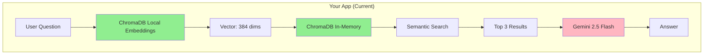

# Vector Database Guide 🗂️

Complete guide to understanding embeddings and when to use different vector databases.

---

## 📚 What Are Embeddings?

**Embeddings** convert text into numbers (vectors) that capture semantic meaning:

```
Text: "Bolkart kredit kartı"
  ↓ [Embedding Model]
Vector: [0.23, -0.45, 0.67, 0.12, -0.89, ...]  (hundreds of numbers)

Text: "Bolkart kredit kartının limitləri"
  ↓ [Embedding Model]
Vector: [0.25, -0.43, 0.71, 0.15, -0.87, ...]  (similar numbers = similar meaning!)
```

Similar meanings = similar numbers = easy to search!

---

## 🔍 Your Current Architecture



**Key Components:**

| Component | What It Does | Cost |
|-----------|-------------|------|
| **ChromaDB** | Stores vectors & searches | FREE |
| **all-MiniLM-L6-v2** | Converts text to embeddings | FREE (local) |
| **Gemini 2.5 Flash** | Generates natural answers | ~$0.075/1M tokens |

---

## 🆚 Vector Database Comparison

### **1. ChromaDB (Your Current Choice) ✅**

```python
import chromadb
client = chromadb.Client()  # In-memory, no setup needed
collection = client.get_or_create_collection("my_data")
collection.add(documents=["text1", "text2"])  # Automatic embeddings!
results = collection.query(query_texts=["search query"])
```

**Pros:**
- ✅ **100% FREE** - no API keys, no quotas
- ✅ **Super simple** - 3 lines of code
- ✅ **Automatic embeddings** - uses built-in model
- ✅ **Fast for small datasets** (< 1M vectors)
- ✅ **Local** - no network calls, privacy
- ✅ **Perfect for prototypes**

**Cons:**
- ❌ In-memory only (data lost on restart)*
- ❌ Not scalable (single machine)
- ❌ No horizontal scaling
- ❌ Basic embedding model (384 dims)

*Can persist to disk with `PersistentClient`

**When to Use:**
- 🎯 Small to medium datasets (< 100K documents)
- 🎯 Prototypes & MVPs
- 🎯 Personal projects
- 🎯 Budget constraints
- 🎯 **Your banking assistant (perfect fit!)** ✅

---

### **2. Pinecone**

```python
import pinecone
pinecone.init(api_key="xxx")
index = pinecone.Index("my-index")
index.upsert(vectors=[{"id": "1", "values": [0.1, 0.2, ...]}])
results = index.query(vector=[0.1, 0.2, ...], top_k=3)
```

**Pros:**
- ✅ **Fully managed** - no infrastructure
- ✅ **Scales to billions** of vectors
- ✅ **Fast queries** even at scale
- ✅ **High availability** (99.9% uptime)
- ✅ **Real-time updates**
- ✅ **Hybrid search** (vector + metadata filters)

**Cons:**
- ❌ **Costs money** ($70+/month for starter)
- ❌ **API key required**
- ❌ **Network latency** (cloud calls)
- ❌ **More complex** setup
- ❌ Must generate embeddings yourself

**Pricing:**
- Free tier: 1M vectors (limited features)
- Starter: ~$70/month
- Production: $500+/month

**When to Use:**
- 🎯 Large-scale production apps (1M+ vectors)
- 🎯 Need high availability & SLA
- 🎯 Multiple users, high query volume
- 🎯 Real-time recommendations
- 🎯 E-commerce, large content platforms

---

### **3. Weaviate**

```python
import weaviate
client = weaviate.Client("http://localhost:8080")
client.schema.create_class({"class": "Document", "vectorizer": "text2vec-transformers"})
client.data_object.create({"text": "my document"}, "Document")
results = client.query.get("Document").with_near_text({"concepts": ["search query"]})
```

**Pros:**
- ✅ **Open source** (free self-hosted)
- ✅ **Built-in vectorization** modules
- ✅ **GraphQL API**
- ✅ **Multi-modal** (text, images)
- ✅ **Hybrid search**
- ✅ Cloud option available

**Cons:**
- ❌ More complex setup
- ❌ Requires Docker/infrastructure
- ❌ Steeper learning curve
- ❌ Cloud version costs money

**When to Use:**
- 🎯 Need both graph + vector search
- 🎯 Multi-modal data (text + images)
- 🎯 Self-hosted preference
- 🎯 Complex data relationships

---

### **4. Qdrant**

```python
from qdrant_client import QdrantClient
client = QdrantClient(":memory:")  # or "http://localhost:6333"
client.create_collection(name="my_collection", vectors_config={...})
client.upsert(collection_name="my_collection", points=[...])
results = client.search(collection_name="my_collection", query_vector=[...])
```

**Pros:**
- ✅ **Open source & fast**
- ✅ **Rust-based** (performance)
- ✅ **Rich filtering** capabilities
- ✅ **Easy Docker deployment**
- ✅ **Snapshot support**
- ✅ Cloud option available

**Cons:**
- ❌ Must manage infrastructure
- ❌ Cloud version costs money
- ❌ Smaller community than Pinecone

**When to Use:**
- 🎯 Need advanced filtering
- 🎯 Performance-critical apps
- 🎯 Self-hosted production

---

### **5. FAISS (Facebook AI)**

```python
import faiss
index = faiss.IndexFlatL2(384)  # 384 dimensions
index.add(embeddings)  # numpy array
distances, indices = index.search(query_embedding, k=3)
```

**Pros:**
- ✅ **100% FREE**
- ✅ **Ultra fast** (optimized C++)
- ✅ **No API keys**
- ✅ **Best for research**
- ✅ **GPU support**

**Cons:**
- ❌ Just vectors - no metadata handling
- ❌ No built-in text processing
- ❌ Must manage embeddings yourself
- ❌ No database features (CRUD)
- ❌ Low-level API

**When to Use:**
- 🎯 Research projects
- 🎯 Need maximum speed
- 🎯 Already have embeddings
- 🎯 Simple similarity search only

---

## 🎯 **Decision Matrix**

| Your Situation | Best Choice | Reason |
|----------------|-------------|--------|
| **< 100K documents, personal project** | **ChromaDB** ✅ | Free, simple, sufficient |
| **100K - 1M documents, startup** | **ChromaDB (persistent)** or **Qdrant (self-hosted)** | Cost-effective scaling |
| **1M+ documents, production** | **Pinecone** or **Weaviate Cloud** | Managed, scalable, reliable |
| **Need multi-modal (text+images)** | **Weaviate** | Built-in support |
| **Budget = $0** | **ChromaDB** or **FAISS** | Both completely free |
| **Maximum performance** | **FAISS** or **Qdrant** | Optimized for speed |
| **Want managed service** | **Pinecone** | Zero infrastructure hassle |

---

## 💡 **Your Current Setup: Is It Good?**

### **YES! ✅ ChromaDB is perfect for your banking assistant because:**

1. **Small dataset**: ~13 chunks (Bank of Baku card info)
2. **Low query volume**: Personal use or small team
3. **Fast enough**: In-memory = millisecond responses
4. **Free**: No API costs for embeddings
5. **Simple**: Easy to maintain

### **When to Upgrade:**

| Scenario | Recommendation |
|----------|----------------|
| **Dataset grows to 100K+ chunks** | → Switch to Qdrant (self-hosted) or Pinecone |
| **Multiple users (100+ concurrent)** | → Add persistent ChromaDB or Pinecone |
| **Need better search quality** | → Use OpenAI embeddings (text-embedding-3-small) with ChromaDB |
| **Production SLA required** | → Migrate to Pinecone or Weaviate Cloud |
| **Multi-language support** | → Use multilingual embedding models |

---

## 🔧 **How to Improve Your Current Setup**

### **Option 1: Make ChromaDB Persistent (Recommended)**

Replace line 33 in `backend/rag_system.py`:

```python
# Before (in-memory, data lost on restart)
self.chroma_client = chromadb.Client()

# After (persistent to disk)
self.chroma_client = chromadb.PersistentClient(path="./chroma_db")
```

**Benefits:**
- ✅ Data survives restarts
- ✅ Faster startup (no re-indexing)
- ✅ Still free & local

---

### **Option 2: Use Better Embeddings**

ChromaDB supports any embedding model:

```python
from chromadb.utils import embedding_functions

# Option A: OpenAI (best quality, costs money)
openai_ef = embedding_functions.OpenAIEmbeddingFunction(
    api_key="your-openai-key",
    model_name="text-embedding-3-small"
)

# Option B: SentenceTransformers (free, better than default)
sentence_transformer_ef = embedding_functions.SentenceTransformerEmbeddingFunction(
    model_name="sentence-transformers/paraphrase-multilingual-MiniLM-L12-v2"
)

# Use in collection
self.collection = self.chroma_client.get_or_create_collection(
    name="bank_cards",
    embedding_function=sentence_transformer_ef
)
```

**Multilingual model supports Azerbaijani better!**

---

### **Option 3: Hybrid Search (Vector + Keyword)**

Combine semantic search with metadata filtering:

```python
# Search only credit cards
results = self.collection.query(
    query_texts=["ən yaxşı kart"],
    n_results=5,
    where={"card_type": "credit"}  # Filter by metadata
)
```

---

## 📊 **Cost Comparison (1M queries/month)**

| Service | Embedding Cost | Storage Cost | Query Cost | Total |
|---------|----------------|--------------|------------|-------|
| **ChromaDB** | $0 | $0 | $0 | **$0** ✅ |
| **FAISS** | $0 | $0 | $0 | **$0** ✅ |
| **Qdrant (self-hosted)** | $0 | ~$20/month (server) | $0 | **~$20** |
| **Pinecone** | $0* | $70/month | Included | **$70+** |
| **Weaviate Cloud** | $0* | $25+/month | Included | **$25+** |
| **OpenAI Embeddings** | ~$0.13/1M tokens | Use with ChromaDB | $0 | **$0.13** |

*Must generate embeddings yourself (e.g., with OpenAI)

---

## 🚀 **Migration Path (When You Need It)**

### **Phase 1: Now (MVP)**
```
ChromaDB (in-memory) + Gemini
↓
~13 chunks, personal use
Cost: $0 (embeddings) + ~$0.01 (Gemini)
```

### **Phase 2: Growth (100+ users)**
```
ChromaDB (persistent) + Better embeddings + Gemini
↓
~10K chunks, small team
Cost: $0 (embeddings) + ~$10/month (Gemini)
```

### **Phase 3: Scale (1000+ users)**
```
Pinecone + OpenAI embeddings + Gemini
↓
100K+ chunks, production
Cost: $70 (Pinecone) + $20 (embeddings) + $50 (Gemini) = ~$140/month
```

---

## 📖 **Learning Resources**

- **ChromaDB**: https://docs.trychroma.com/
- **Pinecone**: https://docs.pinecone.io/
- **Weaviate**: https://weaviate.io/developers/weaviate
- **Qdrant**: https://qdrant.tech/documentation/
- **FAISS**: https://github.com/facebookresearch/faiss
- **Embeddings Guide**: https://www.pinecone.io/learn/embeddings/

---

## ✅ **Summary: Your Current Setup**

**What you have:**
```python
# backend/rag_system.py (lines 32-39)
ChromaDB (in-memory)
  + all-MiniLM-L6-v2 (free local embeddings)
  + Gemini 2.5 Flash (LLM)
```

**Is it good?** → **YES! Perfect for your use case!** ✅

**When to change?** → Only when you have:
- More than 100K documents
- More than 100 concurrent users
- Need production SLA (99.9% uptime)
- Budget for managed service

**Next improvement:** Make ChromaDB persistent (2-line change)

---

**Questions?**
- Embeddings = vectors = numbers representing text meaning
- Vector DB = database optimized for searching similar vectors
- ChromaDB = free vector database (perfect for you!)
- Pinecone = expensive but managed (for big companies)
